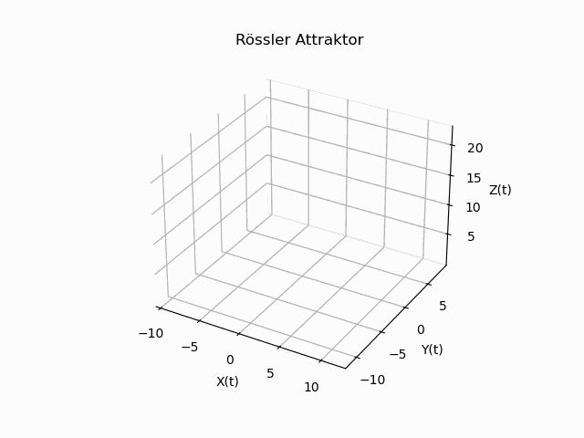

# Roessler Atraktor

## (25.05.2022 – 23.06.2022)

Im Rahmen eines Bachelor-Moduls entwickelte ich ein mathematisches Modell in **Python**, das den **Rössler-Attraktor** beschreibt. 

Der Rössler-Attraktor stellt ein klassisches Beispiel für ein **chaotisches dynamisches System** dar, das durch das sogenannte Rössler-System definiert ist. Dieses **nichtlineare System** basiert auf drei gekoppelten Differentialgleichungen, die die zeitabhängige Entwicklung der Variablen *(x, y, z)* modellieren. Charakteristisch für den Attraktor ist sein chaotisches Verhalten: Bereits minimale Änderungen in den Anfangsbedingungen oder Parametern führen zu signifikanten und nicht vorhersagbaren Abweichungen im Systemverlauf. In der **Chaosforschung** dient die Simulation des Rössler-Attraktors häufig als Untersuchungsgrundlage für nichtlineare Dynamik und deterministisches Chaos. Für die numerische Integration der Differentialgleichungen und die Visualisierung der Ergebnisse nutzte ich **Python** als Programmiersprache.

---
## Projektdetails
- **Modell**: Mathematisches Modell des Rössler-Attraktors  
- **Numerische Verfahren**: Runge-Kutta-Methoden (4. und 8. Ordnung)  
- **Verwendete Tools und Bibliotheken**: Implementierung in **Python**  
  - *NumPy*  
  - *SciPy.integrate*  
  - *Matplotlib.pyplot*  
  - *mpl_toolkits.mplot3d*  
  - *Matplotlib.animation*  

---

## Ergebnisseübersicht  

- **Code**: Der Python-Code zur Implementierung des Rössler-Attraktors, einschließlich der numerischen Lösung mit dem Runge-Kutta-Verfahren sowie der Animation, befindet sich im Jupyter Notebook *Roessler Atraktor.ipynb* in [meinem Repository](https://github.com/DucTung269/Roessler-Atraktor).  

- **Animation**: Die Dynamik des Rössler-Attraktors wird in der folgenden Abbildung als Animation dargestellt.  

